# HW 1 Практика

## Этап 1

В целом мы всегда хотим отслеживать процент успешных запросов. Кроме того, неплохо бы понимать процент распределения запросов по созданию / обновлению / удалению значений в бд. 

Хорошего графика по успешным запросам не хватает, потому добавлю его сам.

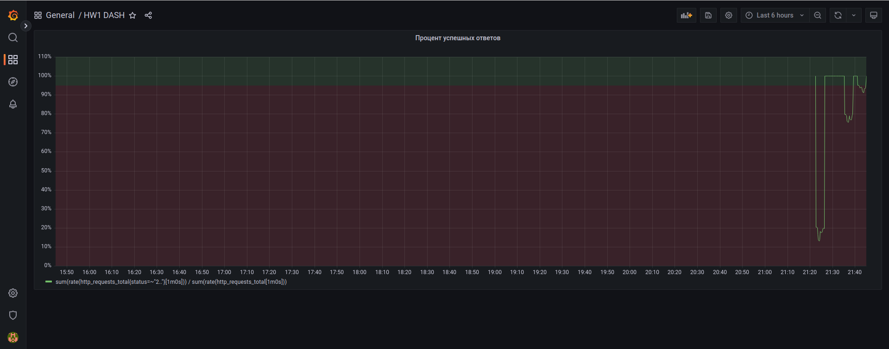

На графике, кстати, видно не очень успешные запросы. А всё дело в том, что нагрузочные тесты предполагают наличие записей о пользователях 1 и 2 в бд, чего не было прописано отдельно. В связи с этим, все POST запросы падали, отчего успешные были только GET запросы. 

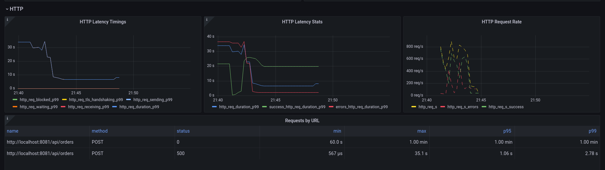

Потому, прежде чем стрелять, добавим пользователей с id 1 и 2, чтобы избежать неверной интерпретации тестов.

## Этап 2

Напишем по аналогии следующие скрипты и проверим что происходит с метриками при их запуске.

**Для Wave**

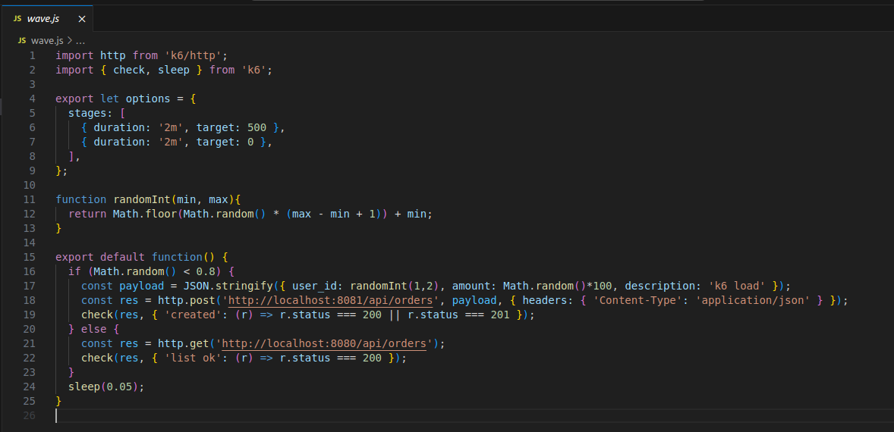
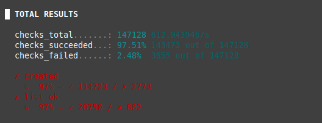
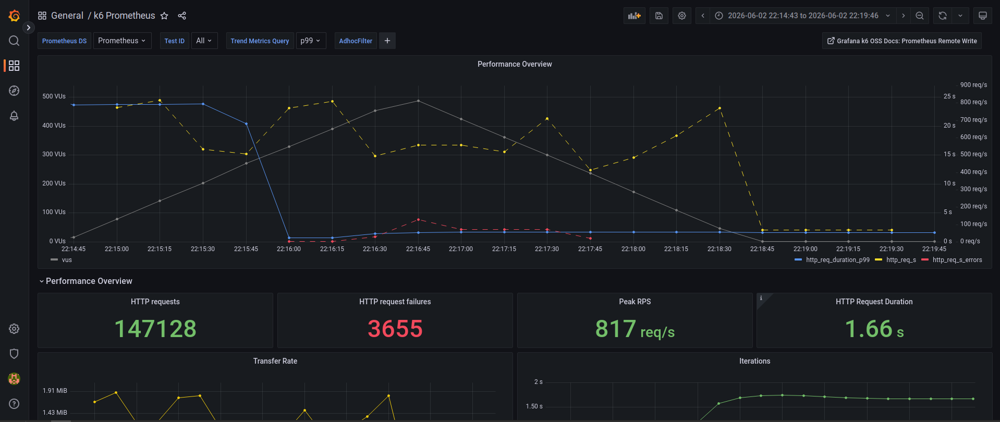
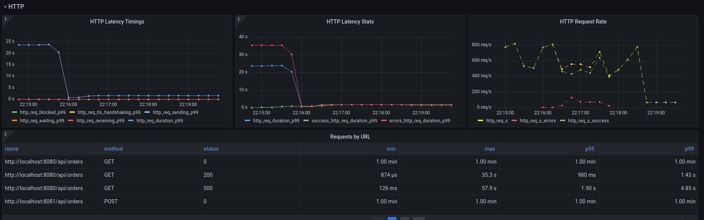
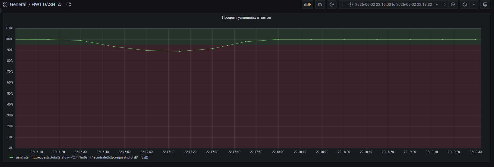
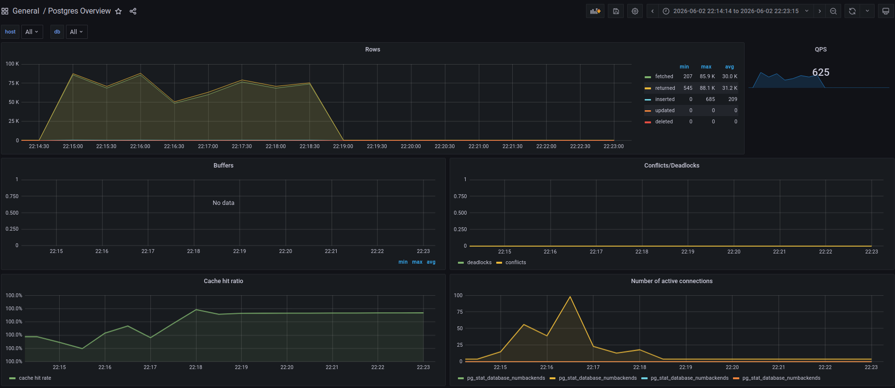

**Для storm**

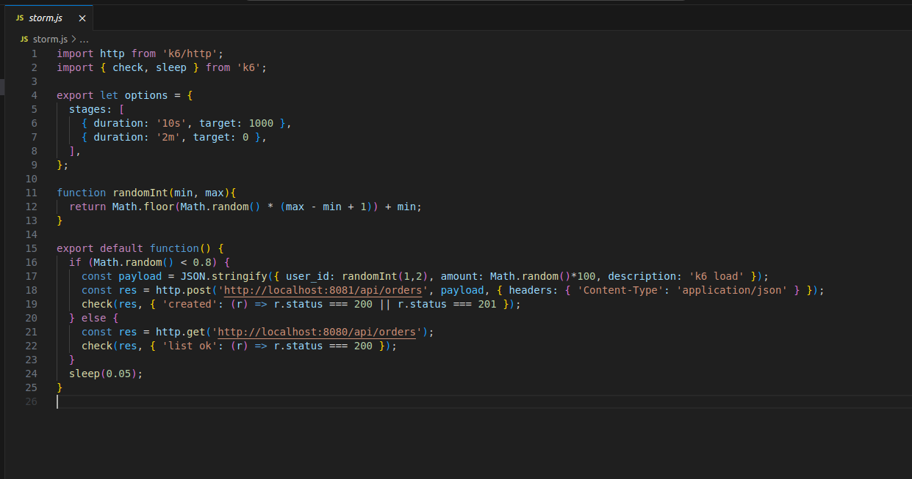
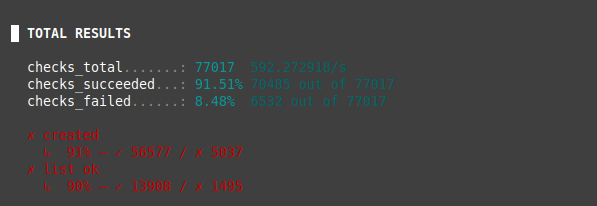
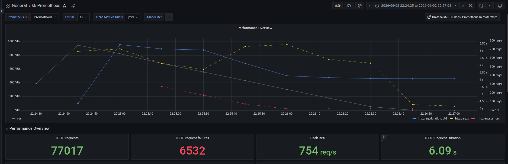
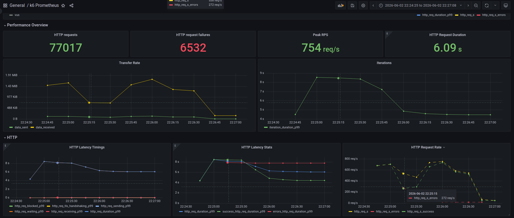
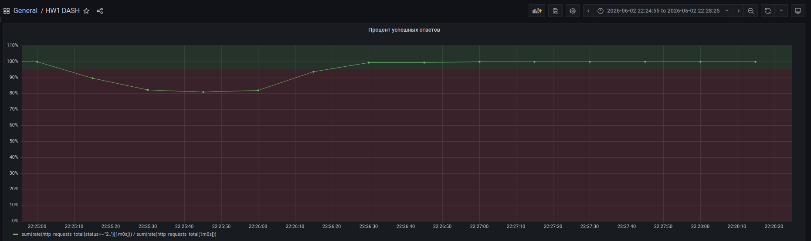
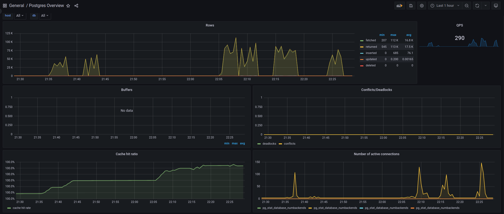

**Кастомный скрипт**

Каждый 10 секунд увеличиваем нагрузку в 2 раза, до 1600, распределением 50 на 50. После - плавное снижение до 0.

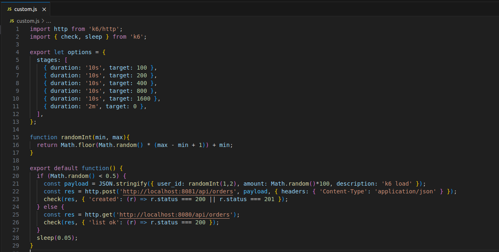
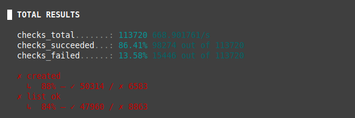
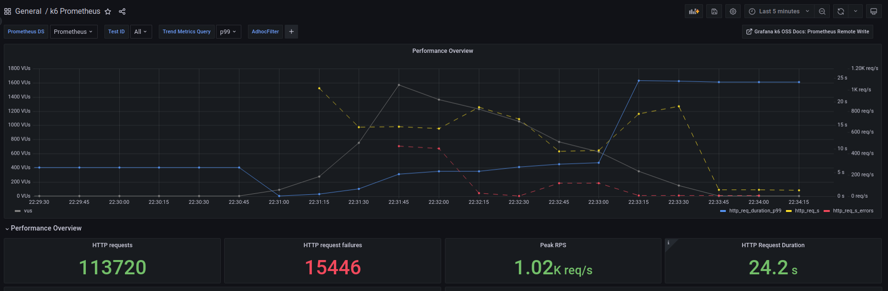
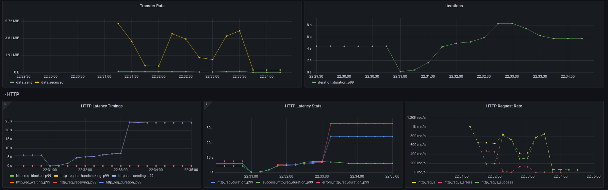
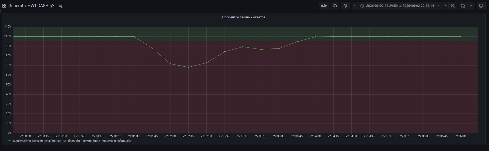
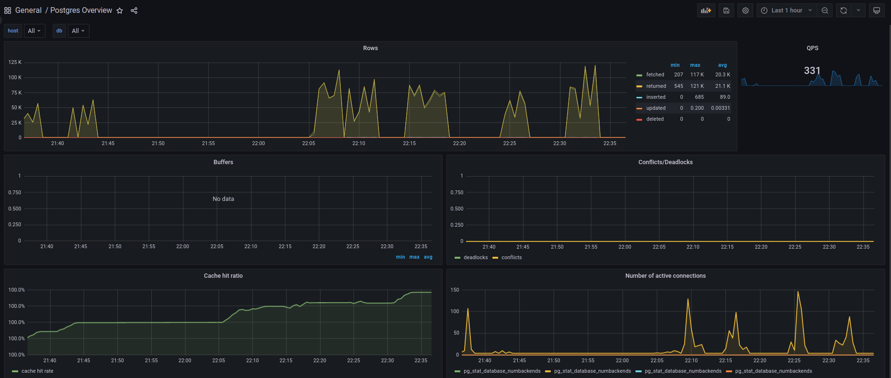

**Дополнительный тест с распределением 0.8**

Дабы проверить гипотезу о проблемах из-за POST, сделаем сравнение финального теста с распределением в пользу POST

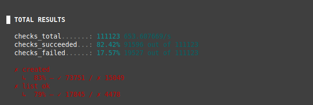
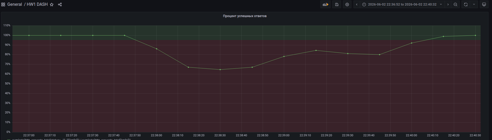
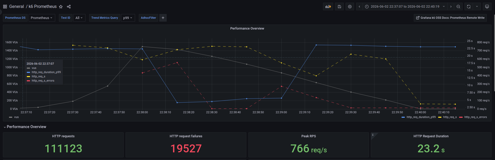

## Этап 3

В целом из графиков видно, что предельный RPS с приемлемым Success Rate - около 400. Далее начинаются проблемы, в особенности при большом количестве POST запросов. Отсюда сразу стоит смотреть в сторону БД. На дашбордах БД видно что резко возрастает количество соединений, отчего можно делать вывод, что их может не хватать (логи подтверждают это). 

## Этап 4

Вариантом решения может являться создание реплики на чтение и записи в мастер (а после и шардирование), таким образом снизим нагрузку на БД. Также стоит увеличить максимальное количество соединений.