# Лабораторная работа 2 (Практика)

В работе рассматривался кластер из нескольких postgres patroni нод.

В первую очередь стоит посмотреть из чего он состоит. Можно увидеть, что имеется 1 лидер и 2 реплики. Такую ситуацию можно часто встретить и в других областях (например OSPF прокол).  

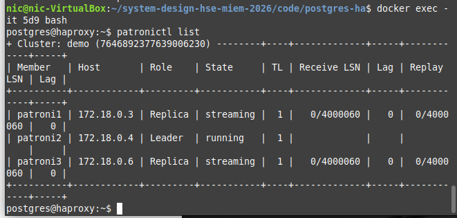

Можно зайти в панель HAProxy и увидеть всё включенные сервисы.
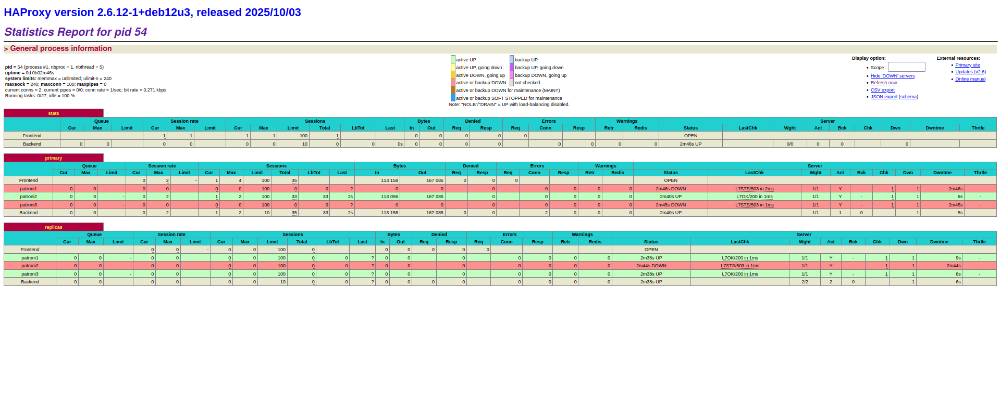

В целом, пока всё работает ничего особо интересного мы не увидим. Тем не менее панель интересная и показывает некоторые важные вещи. Тем не менее, этого явно недостаточно и хорошо настроенные метрики prometheus в связке с grafana дадут гораздо больше.

Теперь поиграемся с включением и выключением контейнеров. Для начала просто запустим генерацию трафика. Видим, что patroni 2 также сообщает в логах, что он лидер. В бд видно что идёт чтение и запись.

Выключим реплику. Ничего плохого не произошло, включив её обратно, она вернётся в кластер. 

Теперь выключим лидера, увидим, что сразу появляется проблема connection lost. Тем временем patroni1 сам себя объявляет лидером, получив ответ от patroni3 и не получив его от patroni2. После этого подключение восстанавливается.

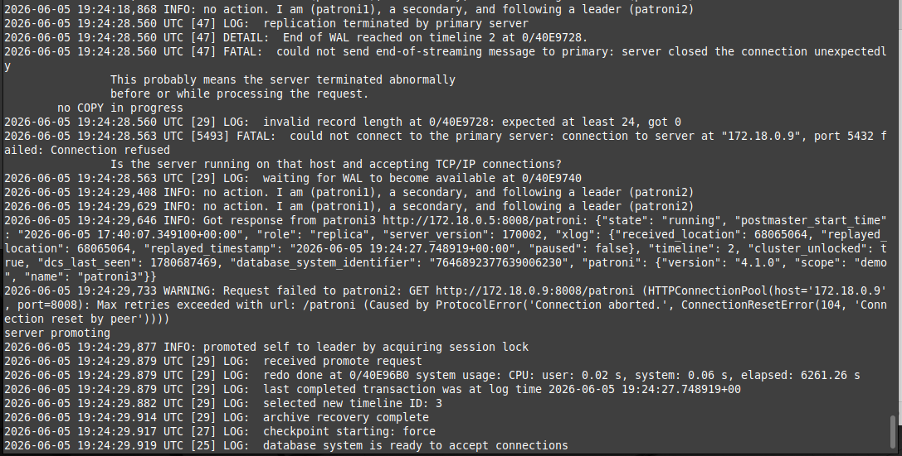

Если включить бывшего лидера, он станет репликой, а не заберёт мастера обратно.

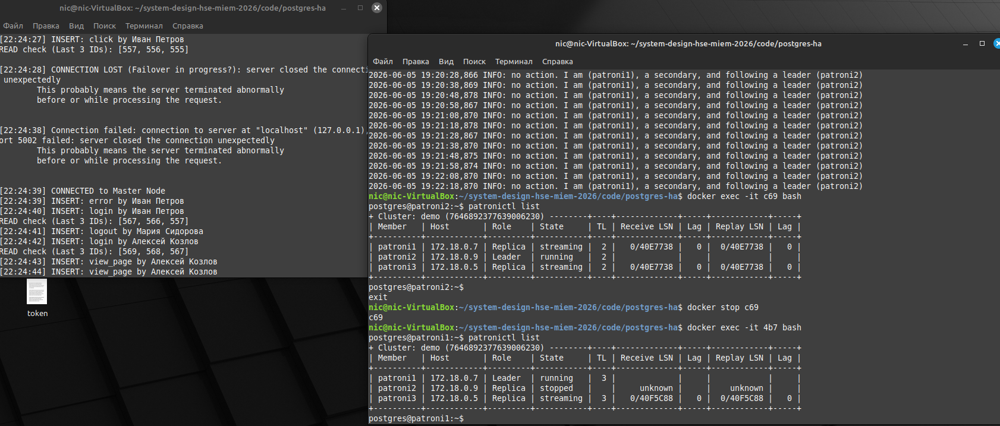

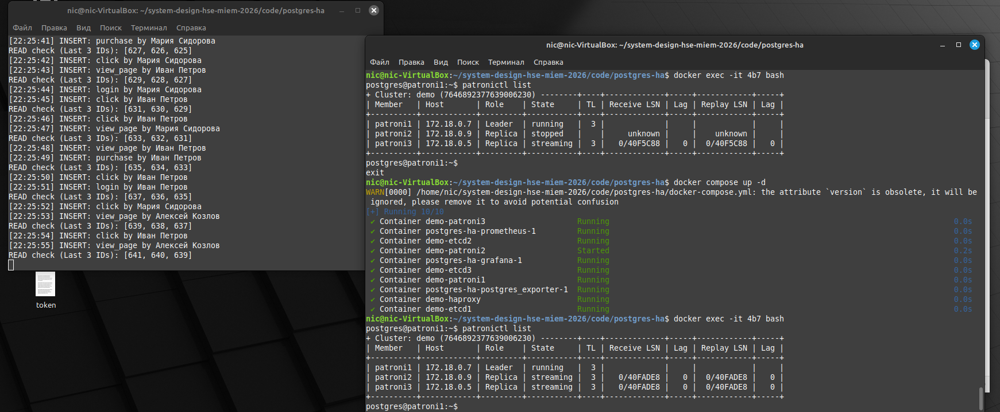

Отключив все реплики, лидер продолжит работать.

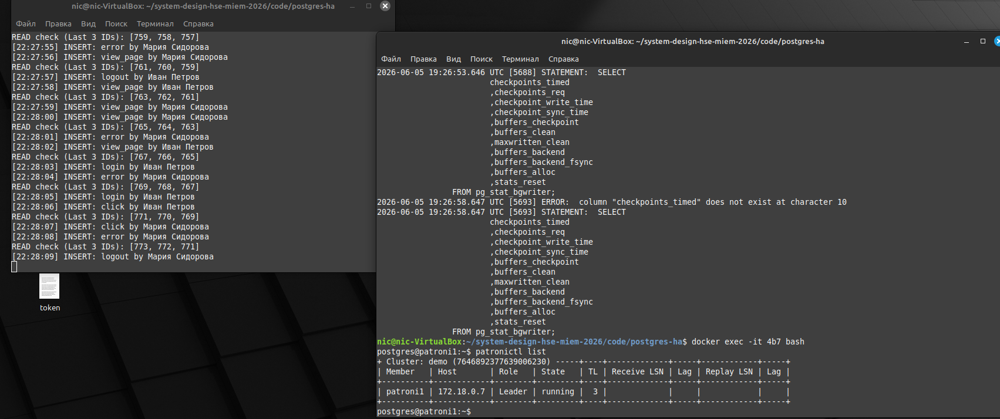

Вернув одну реплику и отключив лидера, реплика станет лидером, даже когда она одна.

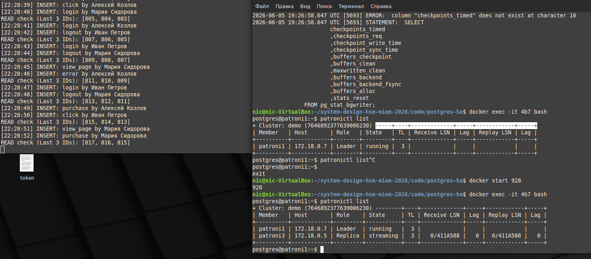

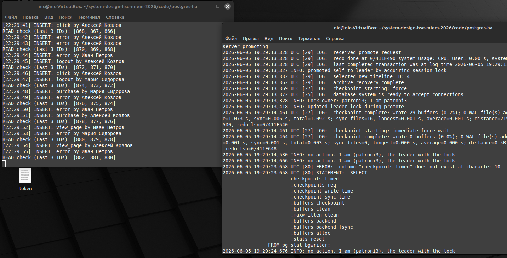

Отключив 1 etcd ничего не сломается.

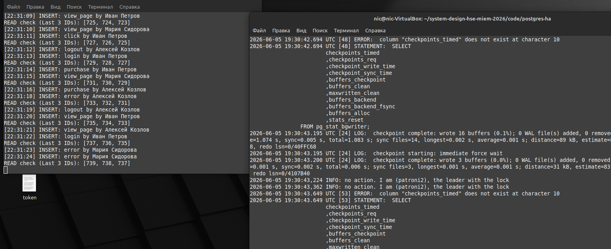

Отключив все etcd увидим следующее:

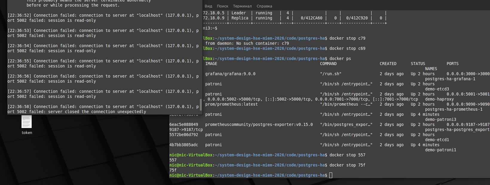

Отсюда делаем вывод, что для кластера также важна работа хотя бы одной реплики etcd, даже если все ноды кластера в рабочем состоянии.

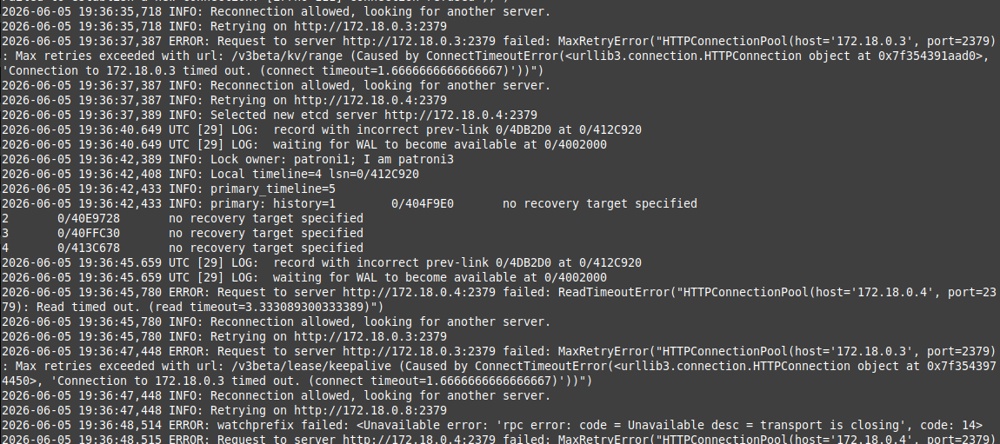

Отключив HAProxy - запросы перестанут доходить до кластера.

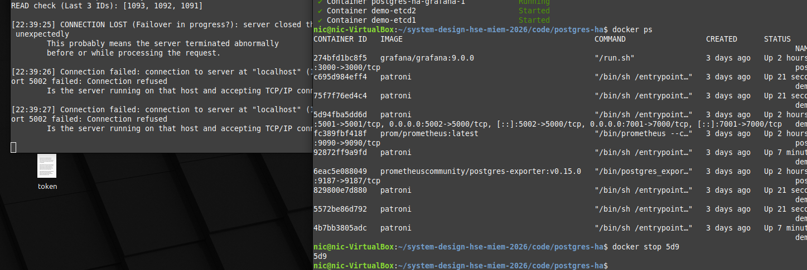

Отсюда делаем вывод, что в нашем приложении узким местом является reverse proxy, которое имеется только в одном экземпляре. В реальной жизни всегда имеется несколько балансировщиков нагрузки со схемами резервирования (например N+1, N*2 и т.д.). Отсюда предлагаю организовать кластер и для reverse proxy, что уберёт единую точку отказа.

Далее можно посмотреть метрики Grafana.

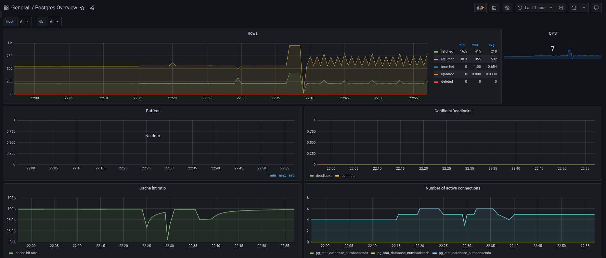

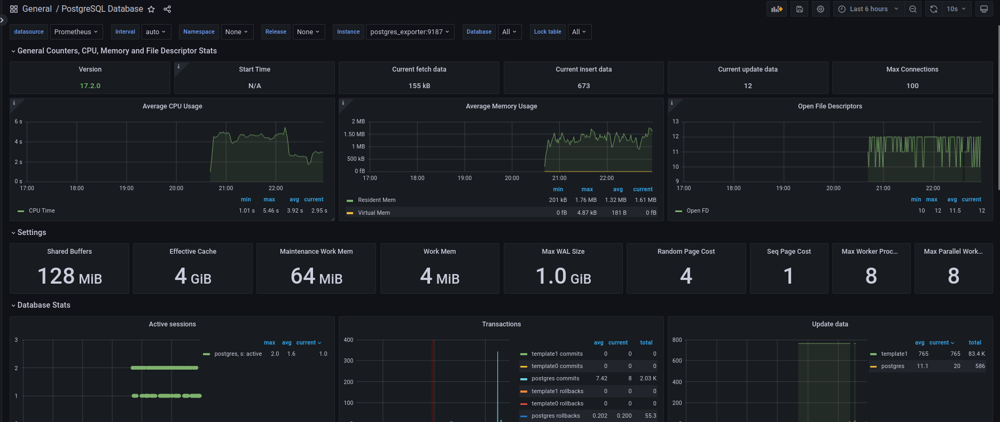

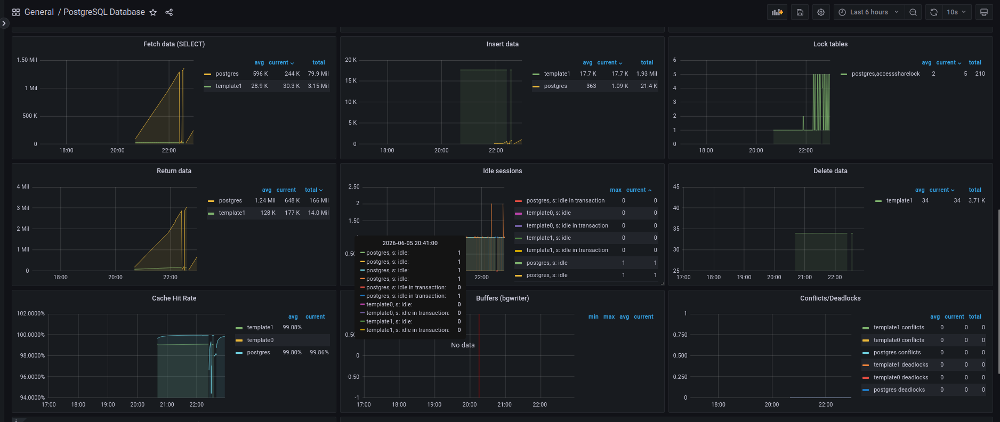

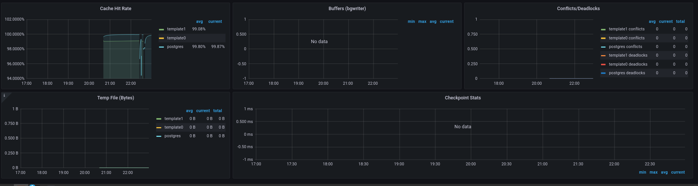

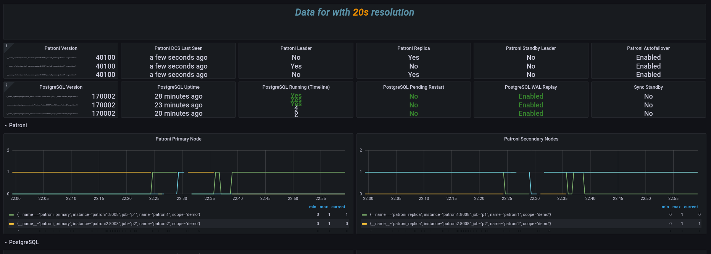

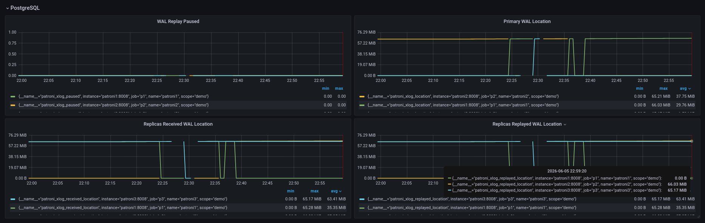

Видим неплохой cache hit. В целом нагрузки большой на приложение не было, потому больших открытий ожидать не стоит.